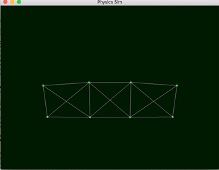

# physics-sim-cuda
This is code written for a physical simulation of a system of mass in springs accelerated with CUDA and visualized with OpenGL

This is what you should see when you compile and run it. You can press the arrow keys to change the viewing perspective!